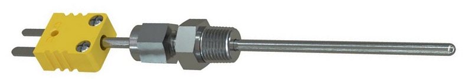
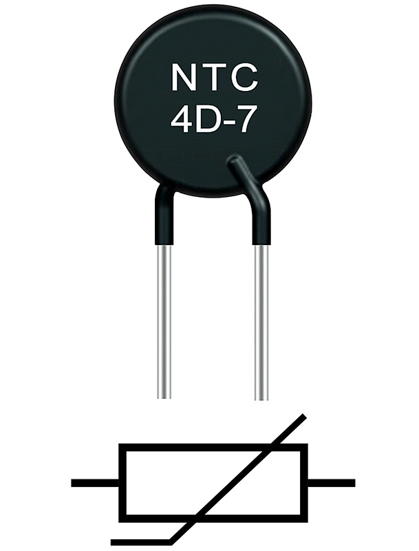
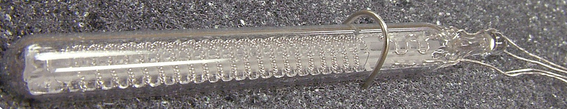
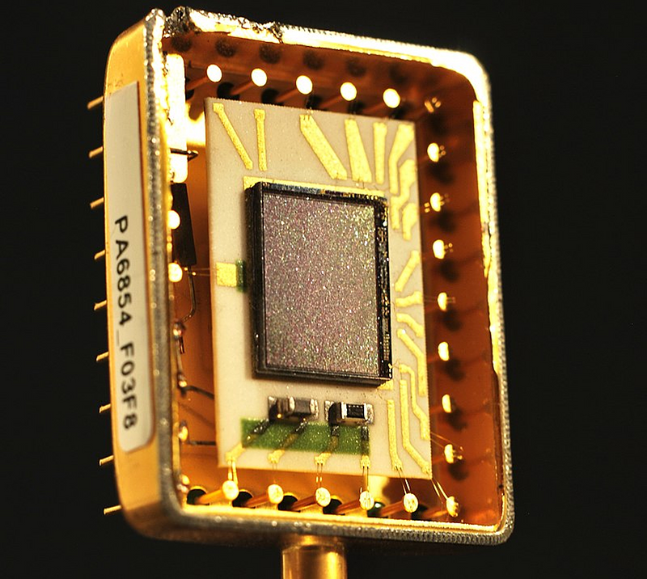
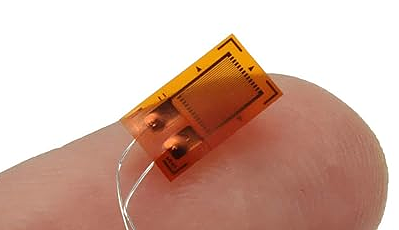
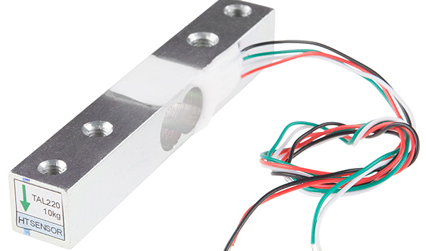
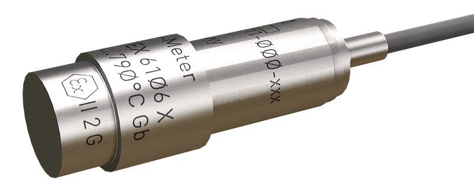
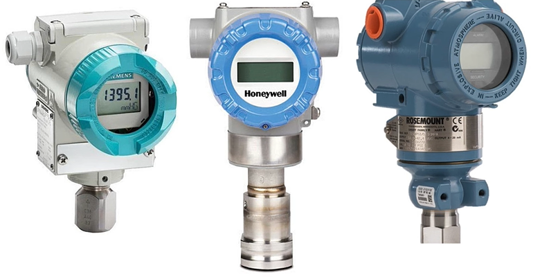
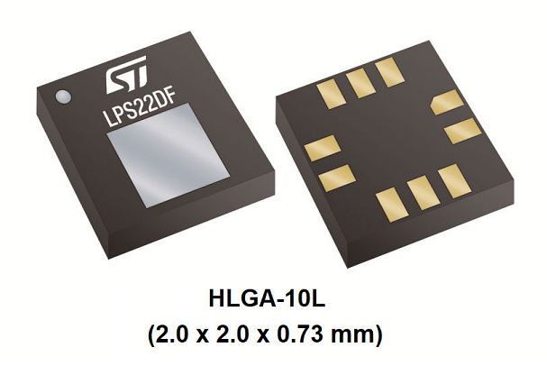
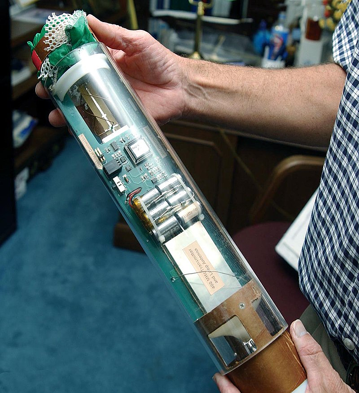

# Introduction to Sensors - I
One of the fundamental tasks in engineering is detecting or measuring a physical phenomenon and converting it into a signal—**sensing**. Sensors are embedded in nearly every system today, from computers and medical devices to industrial automation and environmental monitoring. If you want to apply IoT to any industry as an engineer, you need to know how to use sensors effectively.  This article introduces various sensors and their working principles, offering new engineers an introduction into these incredible devices. The focus will be on providing a basic understanding, without diving deeply into measurement errors, sensor calibrations, physics and math. Also I do not compare sensors, I want to introduce them and give the basic principle of *how they work*.

Lets classify sensors. **Active** sensors need power source to operate, such as radar or ultrasonic. **Passive** sensors do not need external energy, such as thermocouples and photodiodes, they detect environmental energy. **Absolute** sensors measures with respect to a fixed reference, like barometers measuring absolute atmospheric pressure. **Relative** sensors measure changes relative to a baseline or reference point, such as strain gauges measuring deformation relative to an initial state. If we are designing systems as engineers, it is also helpful to classify sensors based on their output. **Analog** sensors provide continuous signals, like temperature sensors. **Digital** sensors output discrete signals, like a proximity sensor.

By utilizing sensors, we can design systems that respond to real-time conditions. We can connect sensors to controllers where we can process and apply logic. In personal IoT applications, for example, you might use a microcontroller like an Arduino or a single-board computer like a Raspberry Pi. For AI-driven implementations, a Jetson Nano is ideal. When high-speed, real-time processing is required, FPGAs are the go-to option. Additionally, ESP8266 or ESP32 are popular for IoT applications due to their built-in Wi-Fi capabilities. For industrial setups, PLCs and SCADA systems are commonly used to control and monitor sensors in large-scale operations.
# Temperature

To have  a temperature sensor we need a physical phenomenon changes regularly and can be measured as temperature changes. In 1593, [Galileo](https://en.wikipedia.org/wiki/Galileo_Galilei) invented a primal device, **thermoscope**, that could detect changes in temperature. It was based on expansion and contradiction of air in a glass bulb to move a column of water. It lacked a numerical scale yet but it was the first attempt and proof of concept of the idea. Around 1612, [Santorio](https://en.wikipedia.org/wiki/Santorio_Santorio) improved upon the thermoscope by adding a numerical scale, one of the first **clinical thermometers**. In 1714, [Fahrenheit](https://en.wikipedia.org/wiki/Daniel_Gabriel_Fahrenheit) developed the **mercury thermometer**, which used mercury's thermal expansion to measure temperature on a calibrated scale. If you ever go to Gdansk I recommend you to visit his monument, it’s great!

### Thermocouples

One of the cheap temperature sensors is the [thermocouple](https://www.msm.cam.ac.uk/utc/thermocouple/pages/ThermocouplesOperatingPrinciples.html), which works based on the Seebeck effect, where two different conductors generate a voltage if there is a temperature difference between their ends. In 1821, Thomas J. Seebeck first observed that when two different metals are joined at two points with different temperatures, a continuous electric current flows. In the picture, there are two different metals inside the long metal rod. With the Seebeck effect, it converts temperature into an electrical voltage signal, functioning as a temperature-voltage transducer.

_Thermocouples_

### Thermistor
A thermistor is a cost-effective temperature sensor that changes its resistance based on temperature variations. It is a semiconductor based resistor. There are two main types: **NTC (Negative Temperature Coefficient)**, where resistance decreases as temperature rises, and **PTC (Positive Temperature Coefficient)**, where resistance increases with temperature. This characteristic makes thermistors ideal for applications requiring precise temperature control within moderate ranges, such as in household appliances and medical devices.

{: width="305" height="400" .w-50 .right}
_Thermistor_

### RTDs
RTDs (Resistance Temperature Detectors) are precision temperature sensors that measure temperature by correlating the resistance of a metal to temperature. Typically platinum is used as a metal, it was proposed by [Sir William Siemens](https://en.wikipedia.org/wiki/Sir_William_Siemens) for resistance temperature sensor. The relationship between resistance and temperature in RTDs is more linear and stable than in thermistors, making them suitable for high-accuracy applications. RTDs are commonly used in industrial processes and laboratory settings where accurate, repeatable temperature measurements over a wide range are critical.

_Resistance Temperature Detector_

### Infrared Temperature Sensors
These sensors focus infrared light through a lens onto a detector, converting it into an electrical signal to be interpreted as temperature. For example, **pyrometers** monitor furnace temperatures in industrial settings, while **infrared thermometers** are widely used in healthcare for non-contact body temperature measurement. **Thermal cameras** are another interesting devices. They use **microbolometer** to detect infrared radiation in the 7.5–14 μm range and converting it into temperature readings by altering their electrical resistance. Generally, thermal cameras contain an array of microbolometers (e.g., 320x240 or 640x480). Each microbolometer in the array acts as a pixel in the thermal image. These cameras can capture heat signatures in total darkness, useful for applications like search and rescue or long-range monitoring or military purposes.

_Microbalometer_

### Semiconductor Temperature Sensors
These are the sensors used to measure temperature in CPUs, GPUs, memory modules, and power supply modules. They work based on temperature-dependent behaviour of transistors (or diodes possible too). The forward voltage drop across the transistor junction decreases predictably as the temperature increases.  Typically, a sensor circuit monitors this voltage shift, and with calibration, it can provide accurate temperature readings. These sensors are directly integrated into processors to monitor thermal conditions. Check the popular [AD590](https://www.analog.com/en/products/ad590.html) IC temperature sensor, if you further wonder its datasheet explains nicely how it works in depth.
# Pressure, Force
> We live submerged at the bottom of an ocean of the element air, which by unquestioned experiments is known to have weight.
> 

-[Torricelli](https://en.wikipedia.org/wiki/Torricelli%27s_experiment), the guy who realized gasses have weight.

Pressure and force sensors are vital in measuring mechanical stress, and we can divide them into piezoresistive, piezoelectric, capacitive, and triboelectric effect sensors. For instance, piezoresistive sensors change their resistance when force is applied, like in strain gauges. There are methods like measuring stress from images—cool stuff—but for now, we will focus on the core sensor types. Measuring pressure is everywhere, from our touchscreens to medical devices, car engines, industrial production mechanisms, and even in weather forecasting systems. Pressure measurements can be made relative to ambient air, a vacuum, or another reference, with terms like **absolute pressure**, **gauge pressure**, and **differential pressure** distinguishing between these methods, depending on the application.

### Strain Gauges
These sensors revolutionized force measurement by using the phenomena that a material's resistance changes with its geometry. If we stretch, the material becomes longer and thinner, increasing its resistance, and if we compress, it shortens and widens, reducing its resistance. The zig-zag pattern of parallel lines in strain gauges allows a longer conductive path in a compact space without affecting sensitivity. The change in resistance is measured using a Wheatstone bridge, ensuring precise detection of stress applied to the material. Strain gauges are used in load cells, which convert force into electrical signals. For example, I used load cells during one of my research internships to measure the force applied on composite materials. They are also used in **scales** that measure your weight when you diet.

_Straing Gauge_

_Load Cell_

### Piezoelectric Pressure Sensors
Some materials generates electric charge proportional to the pressure (piezoelectric materials), so they are great for inferring pressure reading. Since pressure directly genereates the charge, no external power is needed. However, the signal decays over time under constant pressure so it is good for dynamic measurements. Widely used in accelerometers, dynamic pressure sensors, and medical devices like ultrasound machines. Used in engine combustion monitoring, blast measurements, and aerospace systems, medical applications like real-time monitoring of arterial pulses.

_CP211 Piezoelectric Pressure Transducer_

### Capacitive Pressure Sensors

Simply put, a change in pressure moves a diaphragm (a flexible membrane, part of a capacitor), changing the capacitance, which allows us to infer the pressure variation. In general, we call it *capacitive sensing* and this is used to measure many things, not only pressure. If you recall the equation of capacitance, you realize that changing the distance is the most practical way to achieve capacitive sensing. I will not explain the equation here. 

$$
\begin{equation}
  C = \mathcal{E}_r \mathcal{E}_0 \frac{A}{d}
\end{equation}
$$

These sensors are widely used, especially in smart wearable technology and touchscreens. Their extensive use makes capacitive pressure sensors an active area of research, focusing on improving measurement accuracy and further miniaturizing them.

_Capacitive Sensors_

### MEMS Pressure Sensors

This is where things get exciting. MEMS technology allowed the development of microscopic pressure and force sensors using silicon-based processes. Combining mechanical and electronic components on a single silicon chip. Capacitive, or piezoresistive sensing is used here and we already explored their logic above. Their tiny size allows for integration with electronics, enabling features like wireless communication and precise signal processing. Commonly used in airbags, smartphones, wearable devices, and medical instruments.

_Mems Nano Pressure Sensor_

Thanks to this technology, we can build more exciting devices like a dropsonde. A dropsonde is a device dropped from aircraft to measure atmospheric conditions, using multiple sensors to sense pressure, temperature, humidity, and wind speed. The takeaway is that by integrating multiple sensors into a single, compact device, we create powerful systems capable of gathering data efficiently. This same approach—combining multiple sensors on a single chip—allows us to build advanced, multifunctional devices, enhancing everything from environmental monitoring to smart electronics. 

_Dropsonde_
